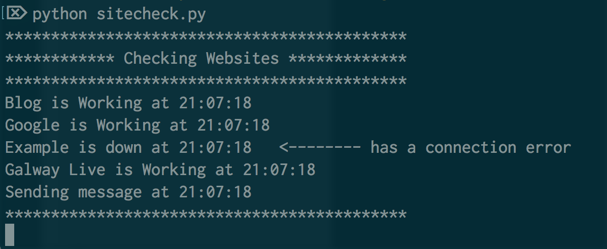
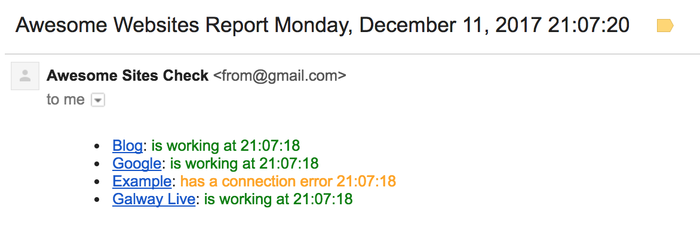

# Awesome Site Check
This python script checks websites on interval that you can set, and it sends a report via email for every check.

### Features:
* Fast performance.
* Sends emails using Gmail.
* Fully customisable.
* Separate websites list file.

### How to:
* Clone the script to your server.
* Change the email variables to match your settings.
* Fill the websites file dictionary with your websites.
* Run the script using [Screen](https://www.gnu.org/software/screen/manual/screen.html#Getting-Started) or [Nohup](https://en.wikipedia.org/wiki/Nohup) to keep it alive.

### Report Example:

---
